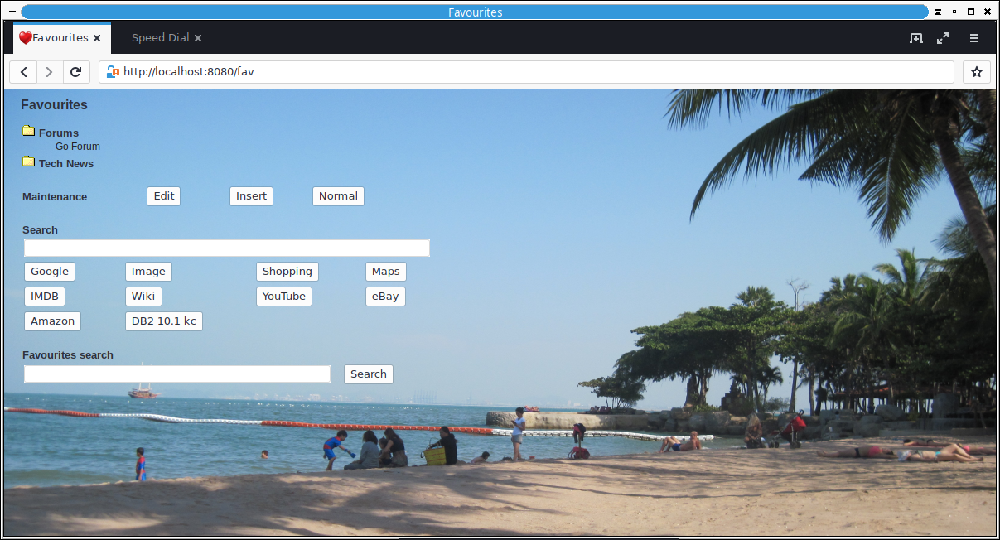

# This has now moved to gitlab, please go there for an up to date version

https://gitlab.com/TonyFle/favourites

# Favourites

A simple web server that can store your favourites. Just runs in the background and is loaded into your browser with http://localhost:8080.  Can be run on any machine in your network if you want to share your favourites on multiple machines.

# Pre-reqs

The only pre-requisit is that sqlite3 must be installed on your machine, as it uses an sqlite3 database to store your favourites.

# Screen shot

You can change the background to any image of your choice.

